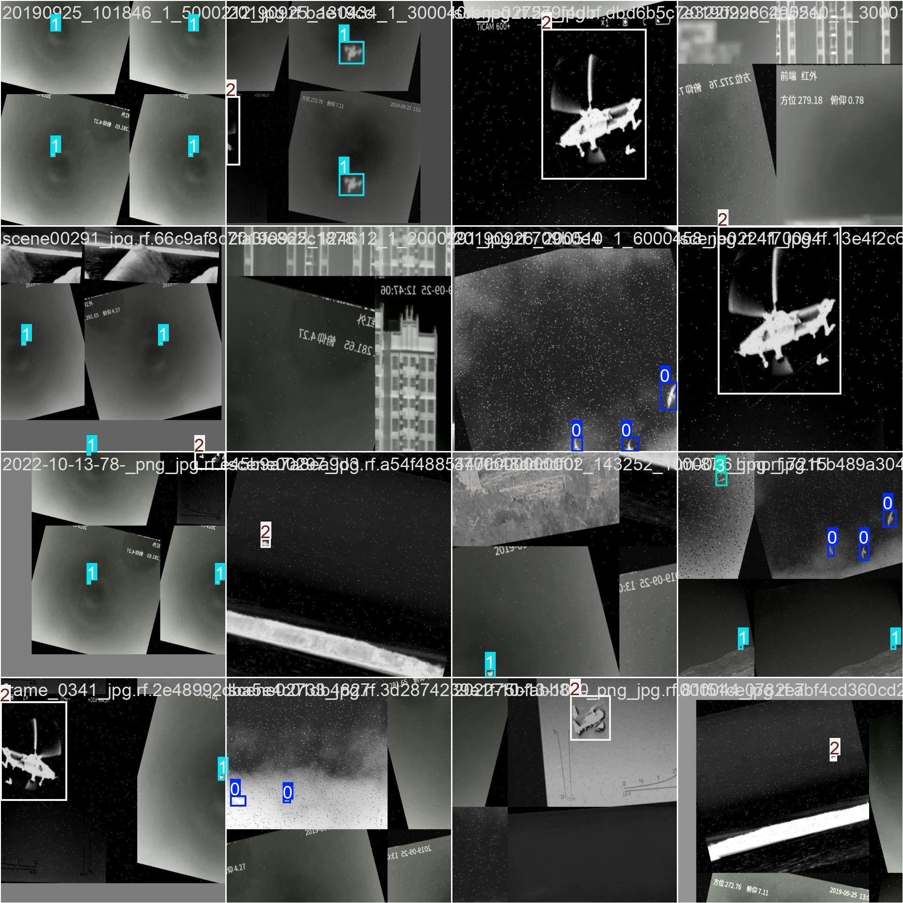

# 🔥 ThermalTracking

**YOLOv8-based Detection and Tracking of Aerial Targets in Thermal Imagery**

[](https://www.python.org/)
[](https://ultralytics.com/)
[](LICENSE)
[]()

> A computer vision system for detecting and classifying aerial targets (drone, plane, helicopter, bird) in thermal/infrared imagery using deep learning.



---

## 🎯 Project Overview

This project implements a **Data-Centric AI** approach to build a robust aerial target detection system for thermal imagery. Instead of relying on pre-made datasets, we engineered a custom "MegaSet" by aggregating, cleaning, and augmenting 11+ public thermal datasets.

### Key Features

- 🔍 **4-Class Detection**: Drone, Plane, Helicopter, Bird
- 📊 **80,000+ Training Images**: Augmented thermal dataset
- 🎯 **73.9% mAP50**: Current best performance (Epoch 10)
- 🔄 **Reproducible**: Deterministic training with `seed=0`
- 📦 **Modular Design**: Clean, extensible codebase

---

## 📁 Project Structure

```
ThermalTracking/
├── src/
│   ├── data_cleaning/      # Dataset preprocessing scripts
│   │   └── clean_label.py  # Label standardization
│   ├── inference/          # Detection scripts
│   │   └── detect.py       # Run inference on images/videos
│   ├── training/           # Training utilities
│   └── tracking/           # [Future] Object tracking
├── notebooks/              # Colab training notebooks
├── configs/                # Configuration files
├── results/                # Training results & visualizations
├── docs/                   # Documentation
└── assets/                 # Images for README
```

---

## 🚀 Quick Start

### Installation

```bash
# Clone the repository
git clone https://github.com/mehmetd7mir/ThermalTracking.git
cd ThermalTracking

# Create virtual environment
python3 -m venv venv
source venv/bin/activate  # Linux/Mac
# venv\Scripts\activate   # Windows

# Install dependencies
pip install -r requirements.txt
```

### Run Inference

```bash
# On an image
python src/inference/detect.py --source image.jpg --weights best.pt

# On a video
python src/inference/detect.py --source video.mp4 --weights best.pt --save

# On webcam
python src/inference/detect.py --source 0 --weights best.pt --show
```

---

## 📊 Training Results

### Dataset Statistics

| Class | Instances | Percentage |
|-------|-----------|------------|
| Drone | 42,679 | 53.4% |
| Bird | 13,014 | 16.3% |
| Helicopter | 12,423 | 15.5% |
| Plane | 11,573 | 14.5% |
| **Total** | **79,689** | **100%** |

### Model Performance

| Epoch | mAP50 | mAP50-95 | Precision | Recall |
|:-----:|:-----:|:--------:|:---------:|:------:|
| 1 | 57.6% | 28.4% | 58.6% | 55.9% |
| 5 | 70.2% | 36.2% | 72.1% | 67.5% |
| **10** | **73.9%** | **39.6%** | **76.4%** | **72.3%** |

> 📈 Training is ongoing. Final results (Epoch 50) will be updated.

### Training Configuration

- **Model**: YOLOv8m (25.8M parameters)
- **Image Size**: 640x640
- **Batch Size**: 16
- **Optimizer**: SGD (auto)
- **Environment**: Google Colab (Tesla T4)

---

## 🔬 Methodology

### Phase 1: Data Engineering ✅

1. **Data Collection**: Aggregated 11 public thermal datasets from Roboflow
2. **Data Cleaning**: Developed `clean_label.py` to standardize labels
   - Unified variations: 'UAV', 'Drone', 'uav' → 'drone'
   - Removed duplicates and invalid annotations
3. **Data Augmentation**: Applied 3x augmentation via Roboflow
   - Blur, Noise, Brightness adjustments
   - Resulting in 80,000+ training images

### Phase 2: Model Training 🔄

- Training YOLOv8m with checkpointing to Google Drive
- Using `seed=0` and `deterministic=True` for reproducibility
- Currently at Epoch 10 with 73.9% mAP50

### Phase 3: Tracking & Optimization 📋

- [ ] ByteTrack integration for multi-object tracking
- [ ] Velocity estimation (pixels/second)
- [ ] ONNX export for edge deployment
- [ ] TensorRT optimization for Jetson

---

## 🛠️ Tech Stack

| Category | Technology |
|----------|------------|
| **Deep Learning** | PyTorch, YOLOv8 (Ultralytics) |
| **Data Management** | Roboflow, OpenCV, NumPy |
| **Training** | Google Colab (Tesla T4 GPU) |
| **Visualization** | Matplotlib, Seaborn |
| **Version Control** | Git, GitHub |

---

## 📚 Documentation

- [Project Overview](docs/PROJECT_OVERVIEW.md)
- [Data Engineering Process](docs/DATA_ENGINEERING.md)
- [Model Training Details](docs/MODEL_TRAINING.md)
- [Future Work & Roadmap](docs/FUTURE_WORK.md)

---

## 🤝 Contributing

Contributions are welcome! Please feel free to submit a Pull Request.

---

## 📄 License

This project is licensed under the MIT License - see the [LICENSE](LICENSE) file for details.

---

## 📧 Contact

**Mehmet Demir** - [@mehmetd7mir](https://github.com/mehmetd7mir)

Project Link: [https://github.com/mehmetd7mir/ThermalTracking](https://github.com/mehmetd7mir/ThermalTracking)

---

<p align="center">
  <b>Built with ❤️ for Defense & Aerospace Applications</b>
</p>
