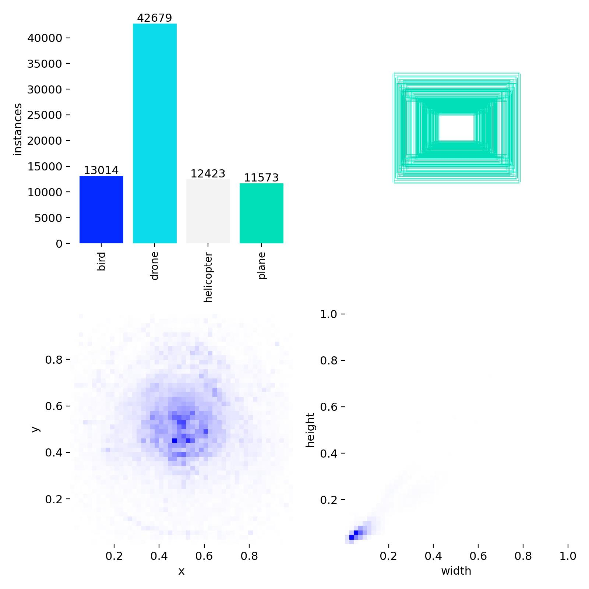

# Data Engineering Process

## Overview

The most critical part of this project was **data engineering**. We adopted a Data-Centric AI approach, focusing on data quality over model complexity.

---

## Phase 1: Data Collection

### Source Datasets

We aggregated **11 public thermal datasets** from Roboflow Universe:

| # | Dataset Name | Images | Classes |
|---|--------------|--------|---------|
| 1 | EG_fross | 3,342 | DRONE |
| 2 | MyFirstProject | 2,534 | 4 classes |
| 3 | UAV_detect | 1,668 | 4 classes |
| 4 | Maximoffs_YOLO | 651 | 4 classes |
| 5 | batul_Uav | 10,000 | uav |
| 6 | TFNet_Drone | 1,200 | Drone |
| 7 | TFNet_Plane | 1,192 | Plane |
| 8 | TFNet_helicopter | 1,200 | Helicopter |
| 9 | TFNet_bird | 1,200 | Bird |
| 10 | Ghada_AirVehicles | 2,334 | 4 classes |
| 11 | NguynQbyt_ThermalDrone | 1,169 | DRONE |
| 12 | TFNet_Mui | 8,362 | 4 classes |

**Total Raw Images**: ~24,000+

---

## Phase 2: Data Cleaning

### The Problem

Each dataset used different naming conventions:

```
Dataset 1: "DRONE", "UAV"
Dataset 2: "drone", "Drone"
Dataset 3: "0", "1", "2", "3" (numeric IDs)
Dataset 4: "Airplane", "AIRPLANE", "plane"
```

### The Solution: clean_label.py

We developed an automated cleaning script that:

1. **Reads all data.yaml files** from each dataset
2. **Validates structure**: Checks for empty names, non-contiguous indices
3. **Standardizes labels**: Maps all variations to 4 standard classes

```python
STANDARD_CLASSES = {
    'bird': 0,
    'drone': 1,
    'helicopter': 2,
    'plane': 3
}

VARIATION_MAP = {
    'DRONE': 'drone', 'Drone': 'drone', 'uav': 'drone', 'UAV': 'drone',
    'Airplane': 'plane', 'AIRPLANE': 'plane', 'aeroplane': 'plane',
    'Helicopter': 'helicopter', 'HELICOPTER': 'helicopter',
    'Bird': 'bird', 'BIRD': 'bird',
    # ... more variations
}
```

4. **Updates label files**: Rewrites all .txt annotation files
5. **Generates report**: Creates scan_report.csv with statistics

### Usage

```bash
python src/data_cleaning/clean_label.py \
    --data_dir ../MegaSet_RawData \
    --output_dir ../MegaSet_Cleaned \
    --report_file scan_report.csv
```

---

## Phase 3: Data Augmentation

After cleaning, we used **Roboflow** to apply 3x augmentation:

### Augmentation Techniques

| Technique | Settings |
|-----------|----------|
| **Blur** | Up to 2.5px |
| **Noise** | Up to 3% |
| **Brightness** | ±25% |
| **Cutout** | 5 boxes, 5% each |

### Final Dataset Statistics

| Split | Images | Augmented |
|-------|--------|-----------|
| Train | 24,713 | 74,139 (3x) |
| Valid | 4,656 | 4,656 |
| Test | 2,000 | 2,000 |
| **Total** | **31,369** | **80,795** |

---

## Quality Assurance

### Validation Checks

1. ✅ No empty label files
2. ✅ All bounding boxes within [0, 1] range
3. ✅ Consistent class IDs across all datasets
4. ✅ No duplicate images
5. ✅ Proper train/val/test split

### Class Distribution



The dataset is slightly imbalanced with more drone samples, which reflects real-world scenarios.
